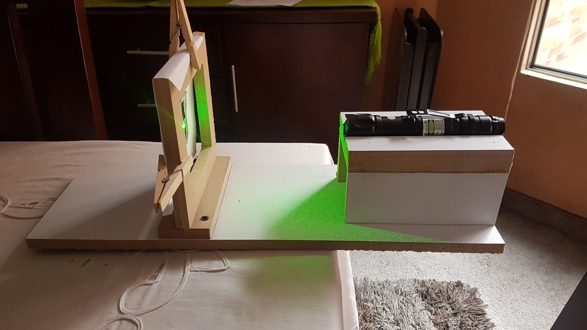
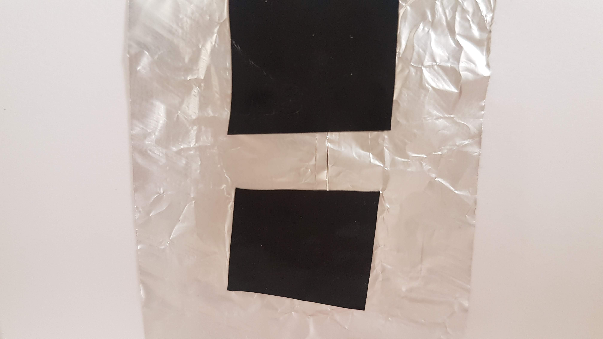
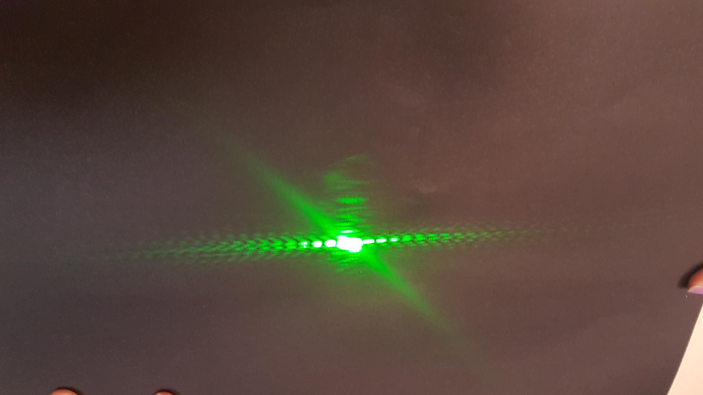

# Complex Number Library
[](https://www.codacy.com/app/nicoga97/Complex-number-library?utm_source=github.com&amp;utm_medium=referral&amp;utm_content=nicoga97/Complex-number-library&amp;utm_campaign=Badge_Grade)

This is a java library in which you can find most of complex numbers, vectors and  matrix operations.
## Running tests
To run automated tests just type:
```
mvn test
```
##### ComplexExercisesTest
Here you can find 4 different tests representing 
cuantic an probabilistic experiments.
- **marbleExperimentWithBooleanMatrix:** This test represent  a simple system described by a graph together with some toy marbles.
Imagine the identical marbles as being placed on the vertices of a graph. The state of a system is described by how many marbles are on each vertex.At the end of this
test we will see the state of the system after 4 clicks.

- **marbleExperimentWithComplexNumbers:** This test represent the same as bellow but now instead of dealing with a bunch of marbles moving about, we shall
work with a single marble. The state of the system will tell us the probabilities of the marble being on each vertex.We will work with complex numbers. At the end of this test we will see the state of the
system after 1 click.

- **slitExperiment:** This test represent the classical probabilistic double-slit experiment but in this case we will make use of tree slits and at the end of the test we will see
the final state of the system after 2 clicks.

- **complexSlitExperiment:** this experiment represent the same as bellow but using only two slits and a quantic system.

##### QuantumOperationTest
- **complexAmplitudeProbabilityObservation:** This test the ability of quantumOperations class to calculate the probability of a particle be found in a specific position.
- **amplitudeOfTransition:** This test the ability of quantumOperations class to calculate the amplitude of transition between two complex amplitudes.
- **MeanValue:** This test the ability to calculate the mean value of a ket and observable.
- **Variance:** This test the ability to calculate the variance of a ket and observable.
## Double Slit Experiment
The double slit experiment is one of the greatest mysterys in quantum physics. It consists, with a laser, pass two slits with a beam of light. Normally, you should think that the resulting figure is actually only two slits, but, it makes a patter of a lot of slits! A very weird behavior for us, but basic for the quantum world.


### Explanation

For the sake of basic concepts, it is going to be explained the simplest way possible. So, in physics, a light is pretty much a wave, so when this laser beam of light passes through the two slits, it becomes two expanded waves. But waves have this behavior that when they are overlapped, in some sections (depending of the position of both) they get cancelled. And because of that, it makes this effect like there is a lot of slits that don´t exist. This has a more complicated mathemathical explanation, that to make it short, the resulting probability of two complex numbers can be cero, something that doesn´t happen with only real numbers. This can be seen in a test in this ver library!

The visual explanation of the experiment can be seen on this image:


Note that the blue lines is where the light is going.

### Prove

So just in case it sounded too incredible, we decided to do the experiment ourselves. We tried to do it the best possible way,
the configuration that we use is this one:



As it can be seen, a laser that emits a strong light that goes through a wooden frame that in the middle is the double slit holes. These holes are very small and ver close to each other, like in the following image:



And the result is:



Wow! The behavoir is exactly as it was describes earlier, a strange multiple-pattern has appeared in the wall! So that confirms the strange way that quantum physics works. Fascinating!

Here you can see a video of the full experiment working:

[Double Split Experiment Video](https://youtu.be/QI4jH9bxSb4)

## Built With

* [Maven](https://maven.apache.org/) - Dependency Management

## Authors

* [**Nicolas Garcia**](https://github.com/nicoga97) - *Initial work* 


